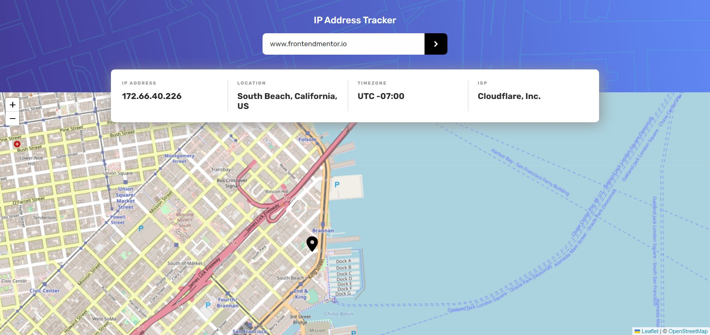

# Frontend Mentor - IP address tracker solution

This is a solution to the [IP address tracker challenge on Frontend Mentor](https://www.frontendmentor.io/challenges/ip-address-tracker-I8-0yYAH0). Frontend Mentor challenges help you improve your coding skills by building realistic projects. 

## Table of contents

- [Overview](#overview)
  - [The challenge](#the-challenge)
  - [Screenshot](#screenshot)
  - [Links](#links)
- [My process](#my-process)
  - [Built with](#built-with)
- [Getting Started](#getting-started)


## Overview

### The challenge

Users should be able to:

- View the optimal layout for each page depending on their device's screen size
- See hover states for all interactive elements on the page
- See their own IP address on the map on the initial page load
- Search for any IP addresses or domains and see the key information and location

### Screenshot




### Links

- [Live Site URL](https://1le00.github.io/ip-address-tracker/)

## My process

### Built with

- Semantic HTML5 markup
- CSS custom properties
- Flexbox
- Mobile-first workflow
- [React](https://reactjs.org/) - JS library
- [Leaflet](https://leafletjs.com/) - An open-source JavaScript library for mobile-friendly interactive maps
- [IP Geolocation API by IPify](https://geo.ipify.org/) - Api for getting Ip Addresses

## Getting Started

To run this project locally, follow these steps:

1. **Clone the repository:**

```bash

git clone https://github.com/1LE00/frontend-assignment.git                                                                                 

cd frontend-assignment

```

2. **Create .env.local file**

- Create a .env.local file in the root directory.
- Save the api key from [IP Geolocation API by IPify](https://geo.ipify.org/) in `REACT_APP_API_KEY` like this 
- REACT_APP_API_KEY=your_api_key

⚠️ **IMPORTANT** ⚠️: To use the IP Geolocation API by IPify, you'll need to sign up for a free account. You won't need to add any cards details to do this and it's a very quick process. This will generate an API Key for you. Usually, you would be able to restrict your API Key to a specific URL (your own domain). This makes sure that other people can't use your API Key on their own websites. IPify doesn't have this feature, but because you aren't adding your card details, this isn't an issue. **So be sure to only sign up for the free account and DO NOT enter any card details**.

3. **Install Dependencies:**

```bash

- npm install

```

4. **Run the Development Server:**
```bash

- npm run dev

```

This will start the development server. Your app will be accessible at `http://localhost:3000/`. If it's a different port see the message in the terminal.